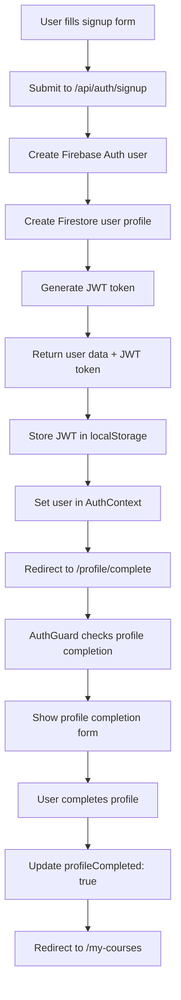

# Registration and Profile Completion Fix

## Issues Identified and Fixed

### 1. **Signup API Missing JWT Token**
**Problem**: After successful registration, users weren't properly authenticated because the signup API didn't return a JWT token.

**Fix**: Updated `/app/api/auth/signup/route.ts` to:
- Generate JWT token after user creation
- Return full user profile data
- Follow the same pattern as signin API

### 2. **Incomplete User Authentication After Signup**
**Problem**: The `signUpWithEmail` function wasn't storing the JWT token, causing authentication issues.

**Fix**: Updated `/data/config/firebase-auth.ts` to:
- Store JWT token in localStorage after successful signup
- Return complete user profile data

### 3. **AuthContext Signup Flow Issues**
**Problem**: AuthContext wasn't properly handling the signup response and profile loading.

**Fix**: Updated `/contexts/AuthContext.tsx` to:
- Set user data immediately from signup response
- Add delayed profile refresh to ensure latest data
- Better error handling

### 4. **Profile Completion Redirect Logic**
**Problem**: AuthGuard wasn't consistently redirecting new users to profile completion.

**Fix**: Updated `/components/AuthGuard.tsx` to:
- Check for missing profile fields in addition to `profileCompleted: false`
- Reduced timeout for profile loading
- Added profile completion check before role validation
- Better handling of new users

### 5. **Header Component Role Display Error**
**Problem**: Header was trying to display raw role value which could cause display issues.

**Fix**: Updated `/components/Header.tsx` to:
- Display user-friendly role names ("Instructor" vs "Student")
- Added proper null checking

## Registration Flow (Fixed)

## Profile Completion Logic

### New User Detection
Users are considered to need profile completion if:
- `profileCompleted === false` OR
- Missing essential fields (`college` and `description`)

### Redirect Conditions
Users are redirected to `/profile/complete` unless they're already on:
- `/profile/complete`
- `/login`
- `/signup`

### Profile Fields by Role

#### Instructor Profile Completion
- College/Institution (required)
- Core Teaching Skills (required)
- Additional Teaching Skills (optional)
- Description (required)

#### Student Profile Completion
- College/Institution (required)
- Main Subjects (required)
- Class/Year (required)
- Description (required)

## Technical Changes Made

### API Routes
1. **`/app/api/auth/signup/route.ts`**
   - Added JWT token generation
   - Return complete user profile
   - Consistent response format with signin

### Authentication
2. **`/data/config/firebase-auth.ts`**
   - Store JWT token after signup
   - Better error handling

3. **`/contexts/AuthContext.tsx`**
   - Improved signup flow handling
   - Delayed profile refresh for new users

### Components
4. **`/components/AuthGuard.tsx`**
   - Enhanced profile completion detection
   - Better redirect logic
   - Profile completion check before role validation

5. **`/components/Header.tsx`**
   - User-friendly role display
   - Better null checking

### Pages
6. **`/app/signup/page.tsx`**
   - Added debug logging
   - Better error handling

## Testing Checklist

### Registration Flow
- [ ] User can successfully register with instructor role
- [ ] User can successfully register with student role
- [ ] JWT token is stored after registration
- [ ] User is redirected to profile completion page
- [ ] AuthGuard allows access to profile completion page

### Profile Completion
- [ ] Profile completion form shows role-specific fields
- [ ] Form validation works for required fields
- [ ] Profile completion updates database correctly
- [ ] User is redirected to /my-courses after completion
- [ ] Completed users don't get redirected back to profile completion

### Error Handling
- [ ] Registration errors are displayed properly
- [ ] Profile completion errors are handled gracefully
- [ ] Network errors don't break the flow
- [ ] Incomplete profiles are detected correctly

### Edge Cases
- [ ] Users who skip profile completion can still access the app
- [ ] Existing users with complete profiles aren't affected
- [ ] Page refreshes don't break authentication state
- [ ] Direct navigation to profile pages works correctly

## User Experience Improvements

1. **Smooth Registration Flow**: Users are now properly authenticated immediately after signup
2. **Clear Profile Completion**: Role-specific forms guide users through the process
3. **Better Error Handling**: Clear error messages and fallback behaviors
4. **Consistent State**: Authentication state is maintained across page refreshes
5. **Flexible Completion**: Users can skip profile completion if needed

## Migration Notes

- **Existing Users**: No impact on users with completed profiles
- **New Users**: Will be guided through the improved registration flow
- **Database**: No database migration required
- **Backwards Compatibility**: All existing functionality preserved

## Configuration

Ensure these environment variables are set:
- `NEXT_PUBLIC_FIREBASE_API_KEY`
- `NEXT_PUBLIC_FIREBASE_AUTH_DOMAIN`
- `NEXT_PUBLIC_FIREBASE_PROJECT_ID`
- JWT secret for token generation

The registration and profile completion flow is now robust and user-friendly!
